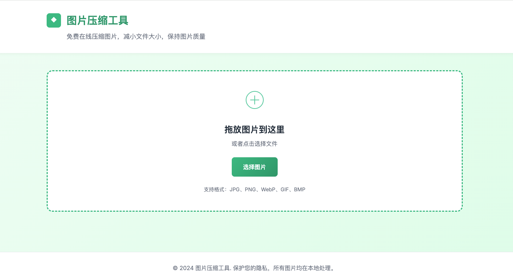
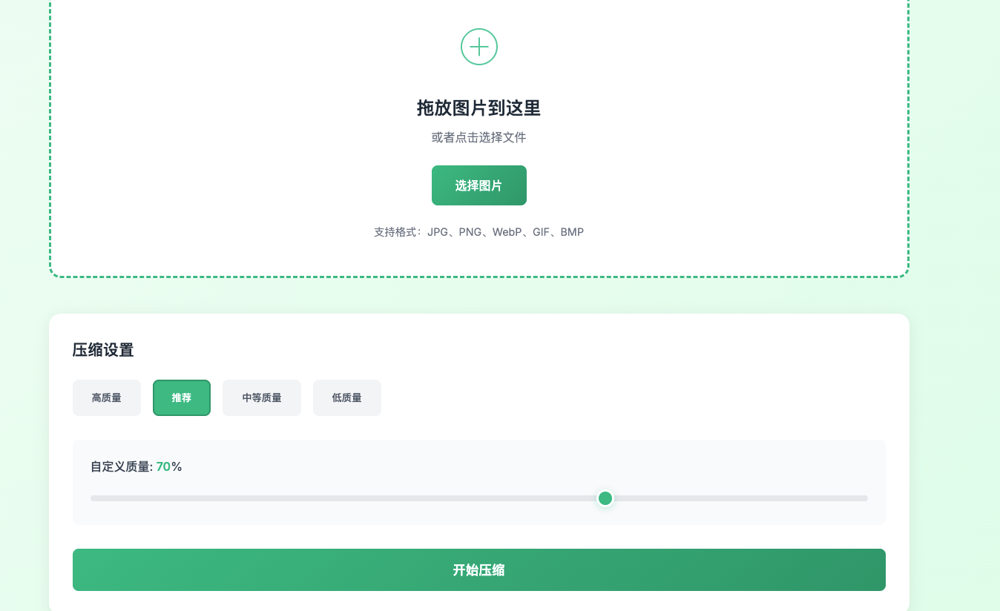
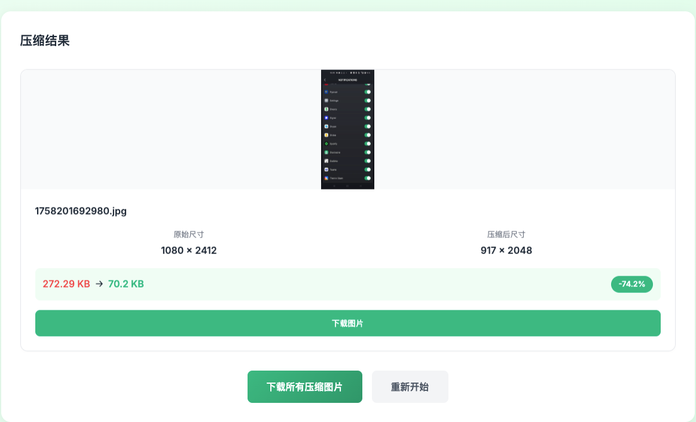

# 图片压缩工具

一个功能强大的在线图片压缩工具，支持多种图片格式的压缩处理，采用现代简约的绿色主题设计。

## 功能特点

### 🖼️ 支持多种图片格式
- **输入格式**: JPG, PNG, WebP, GIF, BMP, TIFF
- **输出格式**: JPG, PNG, WebP
- **批量处理**: 支持同时处理多张图片（最多20个）

### ⚙️ 灵活的压缩设置
- **预设质量**: 高质量(90%)、推荐(70%)、中等(50%)、低质量(30%)
- **自定义质量**: 10%-100%可调节滑块
- **智能格式转换**: 自动选择最佳输出格式

### 📊 详细的结果展示
- **对比显示**: 原始图片与压缩后图片的并排对比
- **数据统计**: 文件大小、尺寸、压缩率等详细信息
- **预览功能**: 压缩后的图片即时预览

### 📱 响应式设计
- **现代简约风格**: 绿色主题，清新美观
- **移动端适配**: 完美支持手机和平板设备
- **拖放上传**: 直观的拖放操作体验

## 📸 界面展示

### 主界面 - 拖放上传区域


简洁明了的主界面，支持拖放上传和点击选择文件。

### 压缩设置界面


提供预设质量选择和自定义质量滑块，满足不同压缩需求。

### 压缩结果展示


详细的压缩结果对比，包括原始图片与压缩后图片的尺寸、大小对比，以及压缩率统计。

## 技术栈

### 前端
- **HTML5**: 语义化标签，支持拖放API
- **CSS3**: Flexbox布局，响应式设计，动画效果
- **JavaScript**: ES6+，Canvas API，文件处理

### 后端
- **Node.js**: 服务器运行环境
- **Express**: Web框架
- **Sharp**: 高性能图片处理库
- **Multer**: 文件上传中间件

## 项目结构

```
image-compressor/
├── public/                 # 前端静态文件
│   ├── index.html         # 主页面
│   ├── style.css          # 样式文件
│   └── script.js          # 前端逻辑
├── server/                # 后端服务器
│   └── server.js          # 服务器入口
├── uploads/               # 上传文件临时目录
├── package.json           # 项目配置
└── README.md             # 项目说明
```

## 快速开始

### 环境要求
- Node.js 14.0 或更高版本
- npm 6.0 或更高版本

### 安装步骤

1. **克隆或下载项目**
   ```bash
   # 如果是在本地创建的目录，请跳过此步骤
   cd image-compressor
   ```

2. **安装依赖**
   ```bash
   npm install
   ```

3. **启动服务器**
   ```bash
   # 开发模式（自动重启）
   npm run dev

   # 生产模式
   npm start
   ```

4. **访问应用**

   打开浏览器访问: http://localhost:3000

## 使用说明

### 单个图片压缩
1. 点击上传区域或拖放图片到指定区域
2. 选择压缩质量（预设或自定义）
3. 点击"开始压缩"按钮
4. 查看压缩结果并下载

### 批量图片压缩
1. 同时选择或拖放多张图片
2. 设置统一的压缩质量
3. 点击"开始压缩"
4. 逐个下载或批量下载所有图片

## API接口

### 压缩单张图片
- **URL**: `POST /api/compress`
- **Content-Type**: `multipart/form-data`
- **参数**:
  - `image`: 图片文件
  - `quality`: 压缩质量 (10-100, 默认70)
  - `format`: 输出格式 (auto/jpeg/png/webp, 默认auto)

### 批量压缩图片
- **URL**: `POST /api/compress-batch`
- **Content-Type**: `multipart/form-data`
- **参数**:
  - `images`: 图片文件数组
  - `quality`: 压缩质量 (10-100, 默认70)
  - `format`: 输出格式 (auto/jpeg/png/webp, 默认auto)

### 获取格式信息
- **URL**: `GET /api/formats`
- **返回**: 支持的格式列表和限制信息

## 配置选项

### 服务器配置
```javascript
// 在 server.js 中可修改以下配置
const PORT = process.env.PORT || 3000;              // 服务器端口
const MAX_FILE_SIZE = 10 * 1024 * 1024;            // 最大文件大小 (10MB)
const MAX_FILES = 20;                               // 最大文件数量
```

### 压缩参数
```javascript
// 压缩选项配置
const compressOptions = {
    quality: 70,           // 压缩质量
    progressive: true,     // 渐进式JPEG
    compressionLevel: 9    // PNG压缩级别 (0-9)
};
```

## 性能特点

### 压缩算法
- **JPEG**: 渐进式编码，支持质量调节
- **PNG**: 最高压缩级别，无损压缩
- **WebP**: 现代格式，更高压缩率

### 安全性
- 文件类型验证
- 文件大小限制
- 临时文件清理
- 错误处理机制

## 部署说明

### 生产环境部署

1. **安装PM2** (进程管理器)
   ```bash
   npm install -g pm2
   ```

2. **启动应用**
   ```bash
   pm2 start server/server.js --name image-compressor
   ```

3. **查看状态**
   ```bash
   pm2 status
   ```

### Docker部署

1. **创建Dockerfile**
   ```dockerfile
   FROM node:16-alpine
   WORKDIR /app
   COPY package*.json ./
   RUN npm ci --only=production
   COPY . .
   EXPOSE 3000
   CMD ["node", "server/server.js"]
   ```

2. **构建和运行**
   ```bash
   docker build -t image-compressor .
   docker run -p 3000:3000 image-compressor
   ```

## 浏览器兼容性

- **Chrome**: 60+
- **Firefox**: 55+
- **Safari**: 11+
- **Edge**: 79+

## 开发说明

### 本地开发
```bash
# 安装开发依赖
npm install

# 启动开发服务器
npm run dev

# 代码格式化 (如果配置了)
npm run format
```

### 贡献指南
1. Fork 项目
2. 创建功能分支
3. 提交更改
4. 推送到分支
5. 创建 Pull Request

## 📝 使用条款

### ⚠️ 重要声明
- **禁止商用**: 本项目仅供学习和个人使用，严禁用于任何商业用途
- **禁止倒卖**: 不得将本项目的代码、功能或服务进行商业化销售
- **保留权利**: 作者保留所有权利，可随时修改使用条款

### 🤝 联系方式
如有问题、建议或合作意向，欢迎联系：

**社交媒体**
- **小红书**: @合肥程序员 </br>
  

- **微信**:  </br>
  

- **GitHub**: huanglinqing123

欢迎扫码添加好友或在GitHub上联系我！

## 许可证

MIT License - 详见 LICENSE 文件

*注意：虽然有MIT许可证，但作者明确禁止商业使用，请尊重作者的劳动成果。*

## 更新日志

### v1.0.0 (2025-10-16)
- 初始版本发布
- 支持多种图片格式压缩 (JPG, PNG, WebP, GIF, BMP, TIFF)
- 实现批量处理功能 (最多20个文件)
- 响应式设计，支持移动端和桌面端
- 拖放上传功能
- 添加界面展示截图
- 完善使用条款和联系方式
- 现代简约绿色主题设计

## 常见问题

### Q: 支持哪些图片格式？
A: 输入支持 JPG、PNG、WebP、GIF、BMP、TIFF，输出支持 JPG、PNG、WebP。

### Q: 图片大小限制是多少？
A: 单个文件最大 10MB，同时最多处理 20 个文件。

### Q: 压缩后的图片质量如何？
A: 可以通过质量滑块调节，推荐设置 70% 能在质量和大小间取得平衡。

### Q: 是否需要网络连接？
A: 本地部署版本无需网络连接，所有处理都在本地完成。

**享受轻松的图片压缩体验！** 🚀
