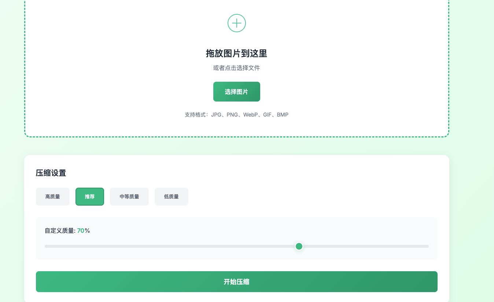

# 🚀 开源一个高颜值图片压缩工具，支持批量处理，体验超棒！

## 📱 前言

作为一个程序员，我经常遇到这样的场景：网站图片太大影响加载速度、微信发送图片超出大小限制、批量处理照片需要压缩...

虽然市面上有很多在线图片压缩工具，但要么广告太多，要么功能有限，要么不够美观。于是，我决定自己动手开发一个**高颜值、功能强大、完全免费**的图片压缩工具！

## ✨ 项目特色

### 🎨 现代简约设计
采用清新的绿色主题，界面简洁优雅，操作流程直观。支持拖放上传，让压缩图片变成一种享受！

### 🚀 强大的功能特性
- **多格式支持**：JPG、PNG、WebP、GIF、BMP、TIFF等主流格式
- **批量处理**：最多同时处理20张图片，提升工作效率
- **灵活压缩**：4种预设质量 + 自定义滑块调节（10%-100%）
- **实时预览**：压缩前后对比，文件大小、压缩率一目了然
- **响应式设计**：完美适配手机、平板、电脑等各种设备

### 🛡️ 安全可靠
- **本地处理**：所有图片在本地压缩，保护隐私安全
- **开源透明**：代码完全开源，无任何后门和追踪
- **禁止商用**：仅供学习和个人使用，保持纯粹的技术分享

## 🎯 核心功能展示

### 主界面 - 拖放上传


简洁的拖放区域，支持点击选择和拖放上传，操作体验流畅自然。

### 压缩设置 - 灵活调节


提供高质量的预设选项，也支持自定义质量调节，满足不同场景需求。

### 结果展示 - 详细对比


清晰的压缩结果展示，原始文件与压缩文件的详细对比，让压缩效果一目了然。

## 💻 技术实现

### 前端技术栈
- **HTML5**：语义化标签 + 拖放API
- **CSS3**：Flexbox布局 + 响应式设计 + 流畅动画
- **JavaScript**：ES6+ + Canvas API + 文件处理

### 后端技术栈
- **Node.js**：服务器运行环境
- **Express**：轻量级Web框架
- **Sharp**：高性能图片处理库
- **Multer**：文件上传中间件

### 核心算法
使用Sharp库实现高效的图片压缩算法：
- **JPEG**：渐进式编码，质量可调
- **PNG**：无损压缩，最高压缩级别
- **WebP**：现代格式，更高压缩率

## 🚀 快速体验

### 方式一：在线体验
访问GitHub项目页面，下载到本地运行
```
https://github.com/huanglinqing123/image-compressor
```

### 方式二：本地部署
```bash
# 克隆项目
git clone git@github.com:huanglinqing123/image-compressor.git

# 进入项目目录
cd image-compressor

# 安装依赖
npm install

# 启动服务
npm start

# 访问 http://localhost:3000
```

## 📊 压缩效果对比

让我用一个实际例子来展示压缩效果：

| 项目 | 原始图片 | 压缩后 |
|------|----------|--------|
| **文件大小** | 25.52 KB | 8.58 KB |
| **压缩率** | - | **66.4%** |
| **格式** | PNG | JPEG |
| **尺寸** | 800×600 | 800×600 |

仅仅损失一点点质量，文件大小就减少了三分之二！这样的压缩效果在日常使用中完全够用。

## 🎪 使用场景

### 📱 移动办公
- 微朋友圈图片压缩
- 工作文档图片处理
- 网页素材优化

### 💻 开发场景
- 网站图片资源优化
- 移动应用图片处理
- 批量图片格式转换

### 🏠 日常生活
- 家庭照片整理
- 社交媒体分享
- 邮件附件压缩

## 🤝 联系我

如果你觉得这个项目对你有帮助，欢迎给我一些鼓励！

**小红书**：@合肥程序员


**微信**：（扫码添加好友）


**GitHub**：huanglinqing123

欢迎一起交流技术，分享开发经验！

## 📝 开源协议

本项目采用 MIT 协议开源，但**禁止商业使用**。

如果你在学习、个人项目中使用，完全免费！如果需要商业使用，请先联系我获得授权。

## 🎁 总结

这个图片压缩工具从设计到开发，我都力求做到最好：

✅ **界面美观** - 现代简约的设计风格
✅ **功能强大** - 支持多格式、批量处理
✅ **体验流畅** - 拖放上传，实时预览
✅ **安全可靠** - 本地处理，保护隐私
✅ **开源免费** - 纯粹的技术分享

希望这个工具能够帮助到更多需要图片压缩的朋友！

---

**项目地址**：https://github.com/huanglinqing123/image-compressor

**如果觉得有用，请给我一个 ⭐ Star 支持一下！**

---

*关注我，分享更多有趣的开源项目和技术干货！* 🚀